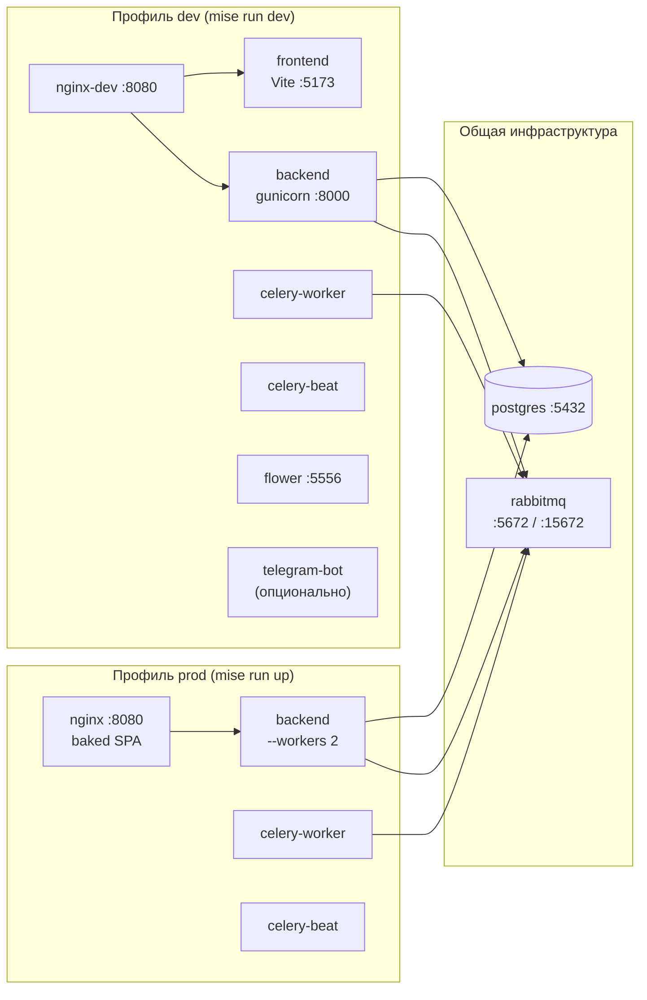
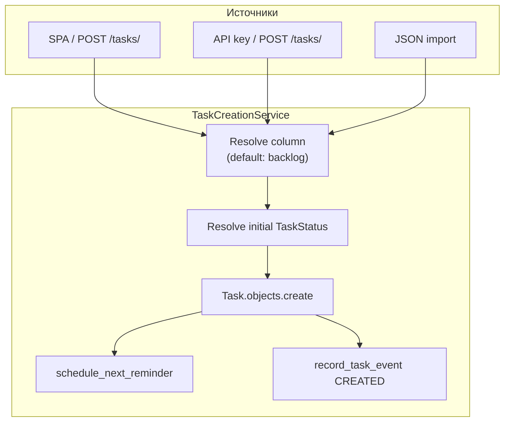
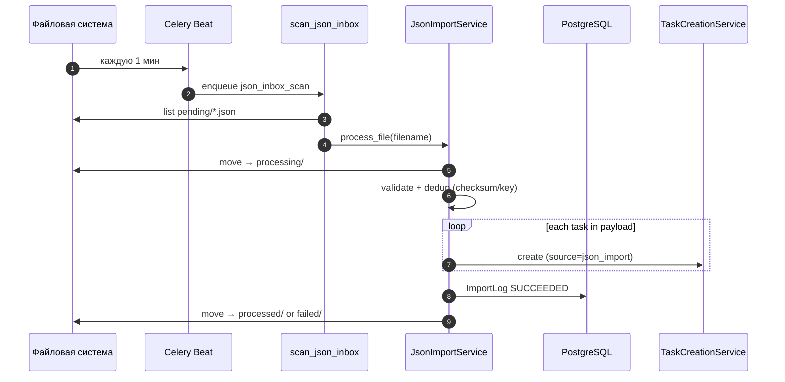
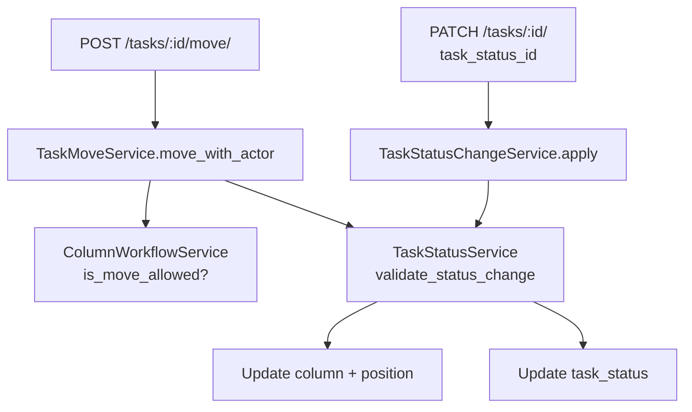
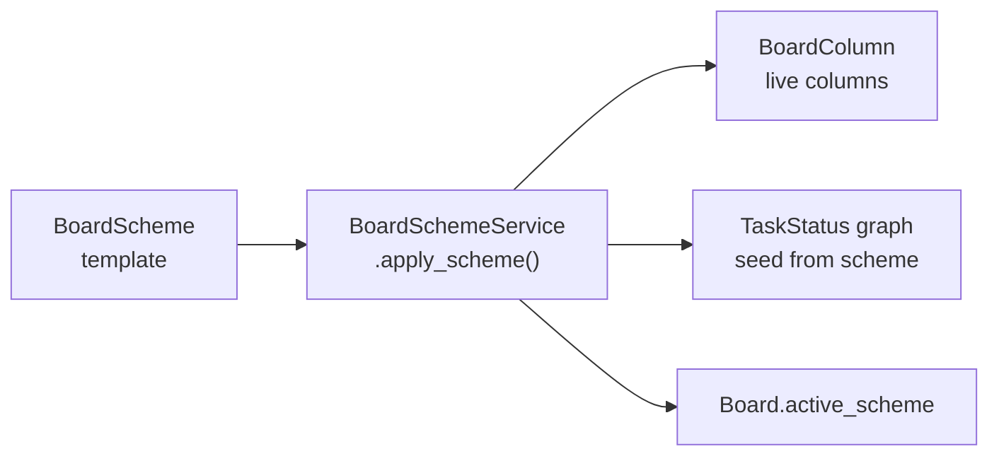
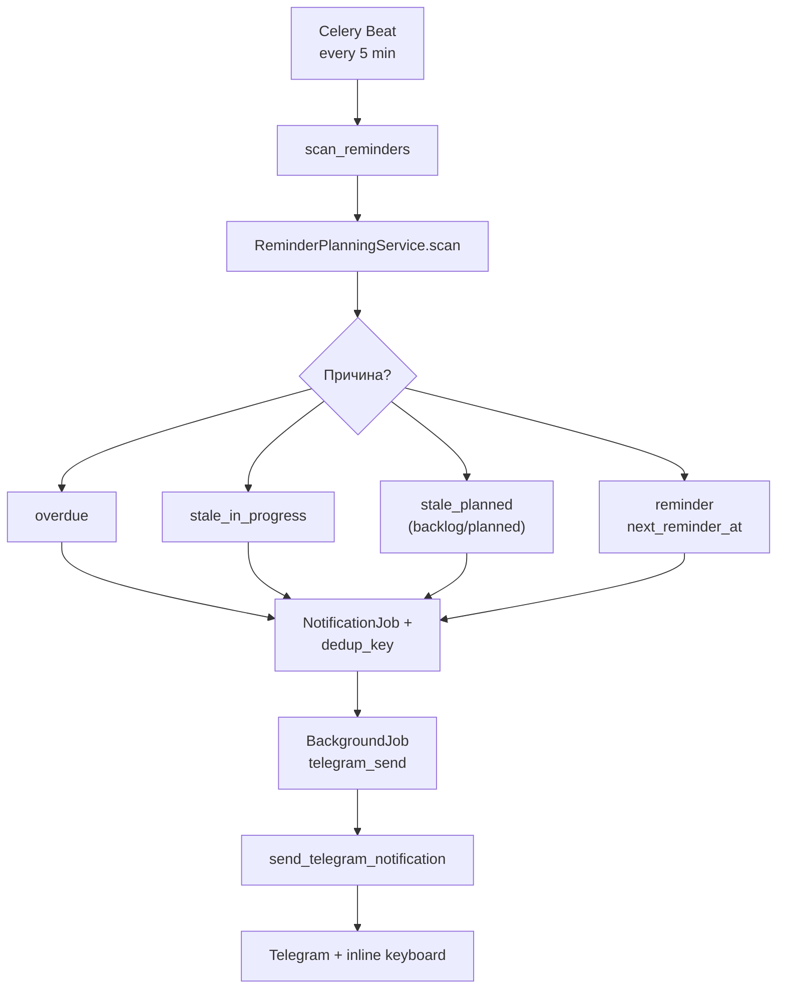
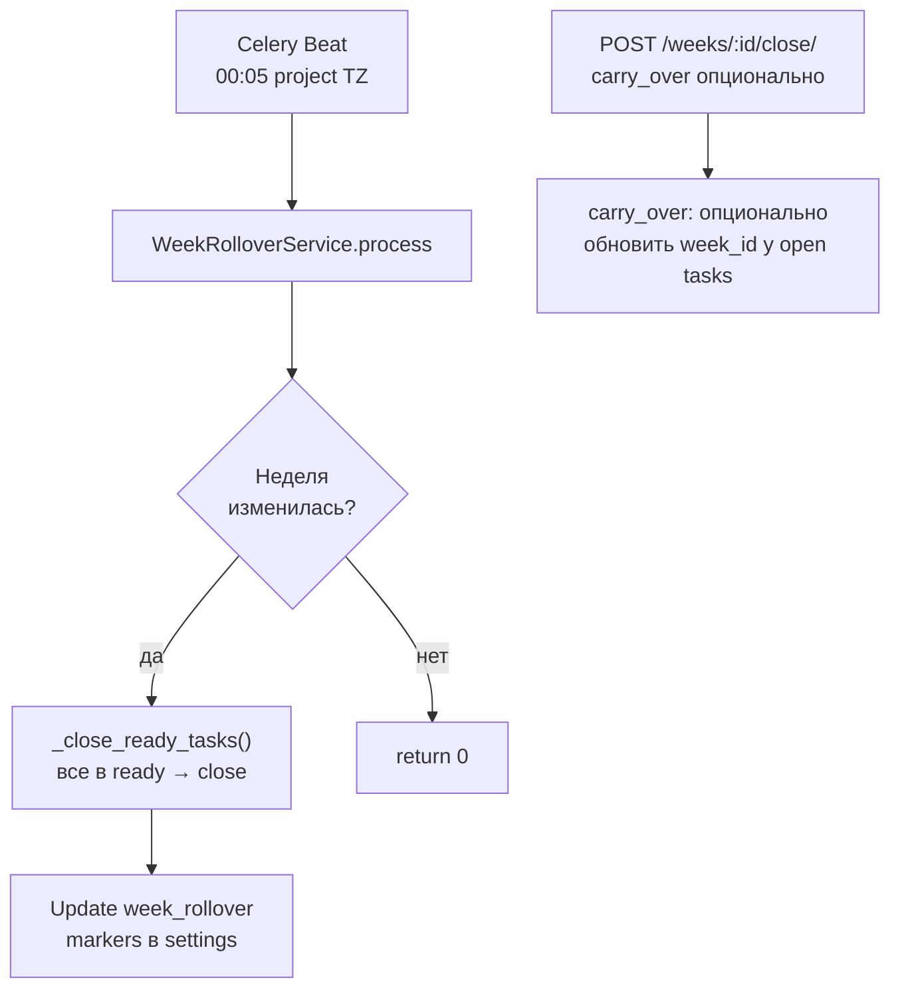
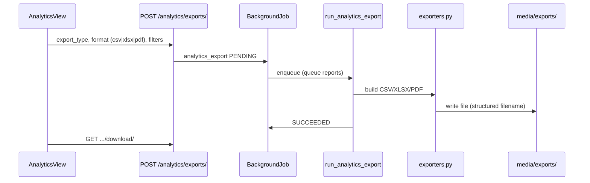
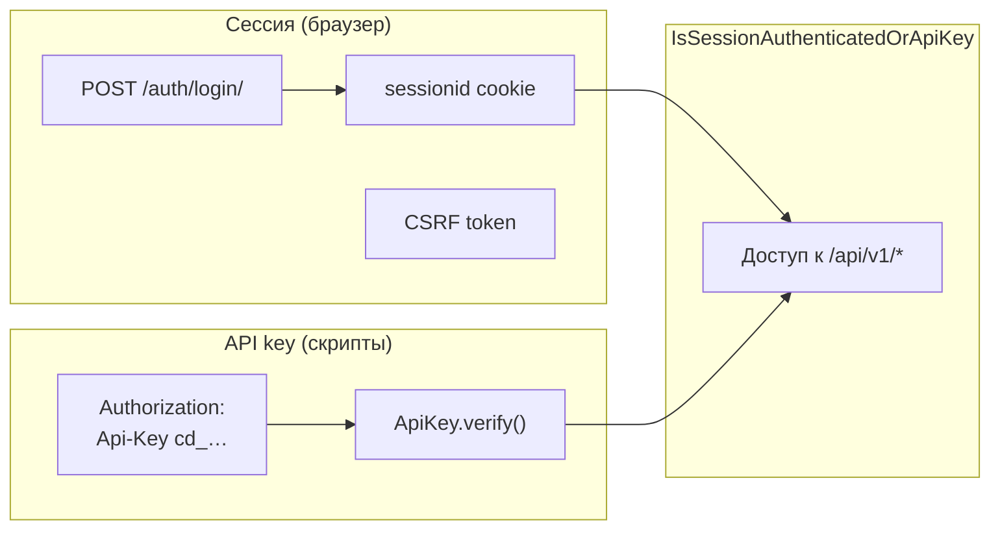

# Cadence — руководство разработчика

Полное описание архитектуры, структуры кода, потоков данных и рабочих процессов. Для быстрого старта см. [README.md](../README.md).

---

## Содержание

1. [О проекте](#1-о-проекте)
2. [Стек и версии](#2-стек-и-версии)
3. [Инфраструктура Docker](#3-инфраструктура-docker)
4. [Структура репозитория](#4-структура-репозитория)
5. [Backend: Django-приложения](#5-backend-django-приложения)
6. [Потоки данных](#6-потоки-данных)
7. [Аутентификация](#7-аутентификация)
8. [Frontend](#8-frontend)
9. [API: обзор эндпоинтов](#9-api-обзор-эндпоинтов)
10. [Фоновые задания Celery](#10-фоновые-задания-celery)
11. [Настройки и переменные окружения](#11-настройки-и-переменные-окружения)
12. [Разработка](#12-разработка)
13. [Тестирование и CI](#13-тестирование-и-ci)
14. [Production](#14-production)
15. [Точки расширения](#15-точки-расширения)

---

## 1. О проекте

**Cadence** (v1.2.0) — персональный недельный Kanban для обучения и pet-проектов. MVP покрывает полный цикл: от приёма задач до архива и аналитики.

### Целевой пользователь

Один разработчик / learner, который:

- планирует работу **по ISO-неделям**;
- хочет **self-hosted** решение без SaaS;
- интегрирует задачи из скриптов, JSON-файлов и (опционально) Telegram;
- настраивает workflow под себя: колонки, схемы, граф статусов.

### Ключевые доменные понятия

| Понятие | Описание |
|---------|----------|
| **Board** | Живая доска (по умолчанию одна, `slug=main`) |
| **BoardScheme** | Шаблон колонок и переходов; можно переключать на доске |
| **BoardColumn** | Колонка Kanban с `system_type`, WIP-лимитом, цветом |
| **TaskStatus** | Узел графа статусов на доске (layout, правила, привязка к колонке) |
| **Task** | Задача: колонка, статус, неделя, теги, напоминания, события |
| **Week** | ISO-неделя (`iso_year`, `iso_week`) с review и close |
| **ImportLog** | Журнал JSON-импорта с идемпотентностью по checksum/key |
| **BackgroundJob** | Универсальная обёртка над Celery-задачами |
| **NotificationJob** | Запланированное Telegram-уведомление с dedup |

### Системные типы колонок

`backlog` · `planned` · `in_progress` · `blocked` · `review` · `ready` · `done`

Схема по умолчанию: **Backlog → In Progress → Ready** (без отдельной колонки Done на доске; закрытие архивирует задачу).

---

## 2. Стек и версии

### Backend (`backend/pyproject.toml`)

| Пакет | Назначение |
|-------|------------|
| Django 6.x | ORM, admin, sessions |
| djangorestframework | REST API |
| drf-spectacular | OpenAPI / Swagger |
| django-environ | `.env` |
| django-unfold | Admin UI |
| Celery 5.x | Асинхронные задачи |
| aiogram 3.x | Telegram bot |
| psycopg 3 | PostgreSQL driver |
| gunicorn | WSGI server |
| openpyxl | XLSX-экспорт аналитики |
| weasyprint | PDF-экспорт аналитики |
| matplotlib | диаграммы в XLSX/PDF-экспорте |

**Dev:** pytest, pytest-django, pytest-cov, ruff, mypy, factory-boy, time-machine
**Менеджер пакетов:** [uv](https://docs.astral.sh/uv/)

### Frontend (`frontend/package.json`)

| Пакет | Назначение |
|-------|------------|
| Vue 3.5 + vue-router 4 | SPA |
| Pinia 3 | Состояние |
| vue-i18n 11 | RU/EN |
| Vite 6 + TypeScript 5.8 | Сборка |
| Tailwind CSS 4 | Стили |
| echarts 6 + vue-echarts | Аналитика |
| @vue-flow/* | Редактор графа статусов |
| vuedraggable + sortablejs | DnD на доске |
| Vitest 3 | Unit-тесты |

**Node:** 22 (Docker, CI)

### Инфраструктура

PostgreSQL 17 · RabbitMQ 3.13 (management) · nginx 1.27 · Flower 2.0 (dev)

---

## 3. Инфраструктура Docker

Один файл `docker-compose.yml` с профилями **`dev`** и **`prod`**.



### Сервисы

| Сервис | Профиль | Роль |
|--------|---------|------|
| `postgres` | всегда | Основная БД |
| `rabbitmq` | всегда | Брокер Celery |
| `backend` | всегда | API, migrate, gunicorn |
| `celery-worker` | всегда | Очереди: `default`, `imports`, `notifications`, `reports`, `maintenance` |
| `celery-beat` | всегда | Расписание периодических задач |
| `nginx-dev` | dev | Прокси `/api/` → backend, `/` → Vite |
| `frontend` | dev | `npm run dev` на :5173 |
| `flower` | dev | UI мониторинга Celery |
| `nginx` | prod | Статика SPA + `collectstatic` + media |
| `telegram-bot` | dev, telegram | `manage.py run_telegram_bot` |

### nginx

- **Dev** (`infra/nginx/conf.d/default.conf`): WebSocket upgrade для Vite HMR
- **Prod** (`infra/nginx/conf.d/prod.conf` + `infra/nginx/Dockerfile`): multi-stage build, `try_files` для SPA

### Volumes

`postgres_data` · `rabbitmq_data` · `static_data` · `media_data` · `frontend_node_modules`

### Backend startup

При старте контейнера `backend`:

1. `uv sync --frozen --no-dev`
2. `manage.py migrate --noinput`
3. В prod: `collectstatic --noinput`
4. `gunicorn cadence.wsgi:application`

---

## 4. Структура репозитория

```text
cadence/
├── backend/
│   ├── cadence/                 # Django project
│   │   ├── settings/
│   │   │   ├── base.py          # общие настройки, Celery Beat schedule
│   │   │   ├── dev.py
│   │   │   ├── prod.py
│   │   │   ├── test.py          # SQLite in-memory для pytest
│   │   │   └── environment.py   # django-environ
│   │   ├── urls.py              # /api/v1/*, /api/docs/, /admin/
│   │   ├── celery.py
│   │   └── wsgi.py
│   ├── apps/
│   │   ├── analytics/           # дашборды и экспорт
│   │   ├── archive/             # read-only архив задач
│   │   ├── boards/              # доска, схемы, колонки, статусы
│   │   ├── common/              # request id, логи, i18n, health
│   │   ├── core/                # auth, settings, tags, platform
│   │   ├── imports/             # JSON inbox
│   │   ├── jobs/                # BackgroundJob registry
│   │   ├── notifications/       # Telegram reminders
│   │   ├── tasks/               # Task CRUD, move, close
│   │   ├── telegram_bot/        # aiogram polling
│   │   └── weeks/               # ISO weeks, rollover, review
│   ├── tests/                   # pytest EC-тесты
│   ├── conftest.py              # фикстуры: api_client, board, columns, …
│   ├── manage.py
│   ├── pyproject.toml
│   └── uv.lock
├── frontend/
│   └── src/
│       ├── app/router.ts
│       ├── components/          # layout, shared UI
│       ├── features/            # доменные модули (см. §8)
│       ├── i18n/                # locales ru/en
│       ├── lib/                 # утилиты (week, datetime, column-display)
│       ├── stores/              # Pinia: auth, board, toast
│       ├── styles/              # глобальные CSS, motion
│       └── shared/
├── infra/nginx/
├── data/task-inbox/             # pending | processing | processed | failed
├── docs/
│   ├── DEVELOPERS.md            # руководство разработчика
│   └── openapi.json
├── logs/                        # CADENCE_LOG_DIR
├── media/                       # exports, uploads
├── staticfiles/                 # collectstatic
├── docker-compose.yml
├── .mise.toml
├── .env.example
└── README.md
```

### Слои backend-приложения

Типичная структура доменного app:

```text
apps/<domain>/
├── models.py
├── serializers.py
├── views.py          # DRF APIView / ViewSet
├── urls.py
├── services.py       # бизнес-логика
├── selectors.py      # read-запросы (где выделены)
├── tasks.py          # Celery tasks (если есть)
├── job_handlers.py   # обработчики BackgroundJob
└── migrations/
```

---

## 5. Backend: Django-приложения

Все маршруты API — под префиксом `/api/v1/`, кроме `GET /api/health/`.

### `common` — сквозная инфраструктура

| Модуль | Назначение |
|--------|------------|
| `request_id.py` | Middleware: `X-Request-ID` echo/generate |
| `celery_logging.py` | Сигналы Celery: prerun/postrun/failure |
| `service_logs.py` | Буфер логов сервисов api/worker + tail файлов + job entries |
| `platform_status.py` | Health агрегатор для UI |
| `i18n/` | Серверные переводы (`t()`, defaults) |

**Endpoint:** `GET /api/health/` → `{"status": "ok"}` (публичный)

### `core` — аутентификация, настройки, теги

**Модели:**

- `ApiKey` — хешированный ключ с префиксом `cd_`
- `ProjectSettings` — singleton (timezone, Telegram, quiet hours, stale thresholds, rollover markers)
- `Tag` — привязан к `BoardScheme`

**Endpoints:** login/logout/me, settings, tags CRUD, platform status/logs, telegram check

### `boards` — доска и workflow

**Модели:**

| Модель | Роль |
|--------|------|
| `Board` | Доска, `active_scheme` FK |
| `BoardScheme` | Шаблон (`slug`, `is_locked`) |
| `BoardSchemeColumn` | Колонка в шаблоне |
| `BoardSchemeTransition` | Переходы между system_type в шаблоне |
| `BoardSchemeTaskStatus` | Статусы в шаблоне |
| `BoardSchemeTaskStatusTransition` | Переходы статусов в шаблоне |
| `BoardColumn` | Живая колонка на доске |
| `ColumnTransition` | Разрешённые переходы колонок |
| `TaskStatus` | Статус на доске (layout, rules, column FK) |
| `TaskStatusTransition` | Ребро графа статусов |

**Сервисы:**

- `BoardSchemeService` — CRUD схем, `apply_scheme()`, seed default
- `ColumnSettingsService` — колонки, reorder, workflow matrix
- `TaskStatusService` — граф статусов, `save_graph()`, `sync_graph_to_scheme()`, seed default/starter

### `tasks` — задачи

**Модели:** `Task`, `TaskTag`, `TaskEvent`

**Источники (`TaskSource`):** `ui`, `api`, `json_import`, `telegram`, `system`

**Доска:** `active_tasks_for_board()` возвращает все задачи с `archived_at IS NULL`. Поле `week` — метка планирования, а не фильтр видимости: открытые задачи прошлых ISO-недель остаются на Kanban после смены недели. Параметр `?week=` в `GET /api/v1/board/` задаёт контекст недели в payload (новые задачи, week review), но не скрывает незакрытые задачи.

**Сервисы:**

- `TaskCreationService` — create с initial status и column binding
- `TaskUpdateService` / `TaskStatusChangeService` — PATCH, смена статуса
- `TaskMoveService` — move между колонками с валидацией workflow + status graph
- `TaskCloseService` / `TaskReopenService` — архив и reopen

### `weeks` — недели

**Модель:** `Week` (iso_year, iso_week, starts_on, ends_on, review_notes, closed_at)

**Сервисы:** `WeekService` (resolve, current, next), `WeekRolloverService`

### `archive` — архив

Без собственных моделей. Read-only queryset `Task` где `archived_at IS NOT NULL`.

### `imports` — JSON inbox

**Модель:** `ImportLog` (status, checksum, idempotency_key, error)

**Поток файлов:**

```text
pending/ → processing/ → processed/ | failed/
```

**Сервис:** `JsonImportService.process_file()`, `InboxPaths.from_settings()`

### `jobs` — фоновые задания

**Модель:** `BackgroundJob`

**Типы (`JobType`):**

| Тип | Описание |
|-----|----------|
| `json_inbox_scan` | Сканирование pending/ |
| `json_import_file` | Импорт одного файла |
| `notification_scan` | Планирование напоминаний |
| `telegram_send` | Отправка в Telegram |
| `telegram_callback` | Обработка callback (логируется) |
| `analytics_export` | Генерация CSV/XLSX/PDF |

**Сервис:** `JobService.create/mark_processing/succeed/fail/retry`

### `notifications` — напоминания

**Модели:** `NotificationJob`, `TelegramCallbackLog`

**Причины (`NotificationReason`):** `overdue`, `stale_in_progress`, `stale_planned`, `reminder`, `manual`

**Сервисы:**

- `ReminderPlanningService.scan()` — планирование
- `NotificationDispatchService` — отправка
- `TelegramActionService` — inline callbacks

### `analytics` — аналитика

**Модель:** `AnalyticsExportJob`

**Типы экспорта:** `tasks`, `archive`, `weekly_summary`, `tag_summary`, `notification_report`, `jobs_report`, `imports_report`

**Форматы:** `csv`, `xlsx`, `pdf`

**Слои:** `selectors.py` (агрегации), `export_data.py` (строки отчётов), `exporters.py` (writers), `export_preview.py` (preview API), `xlsx_builder.py` / `pdf_builder.py`, `export_filenames.py`, `services.py` (оркестрация)

### `telegram_bot` — бот

- `manage.py run_telegram_bot` — long polling
- `/start` — выдача chat_id для настройки
- Inline keyboard → `TelegramActionService.handle_callback()`
- Без REST URL и собственных моделей

---

## 6. Потоки данных

### 6.1. Создание задачи (общая схема)



**Детали:**

1. Если есть initial status с привязкой к колонке — задача может оказаться в колонке статуса, а не в запрошенной.
2. Теги резолвятся через `TagService` в scope активной схемы.
3. Неделя — опционально (`2026-W12`); иначе без привязки.

### 6.2. JSON-импорт



**Альтернативные входы:**

- `POST /api/v1/imports/upload/` — загрузка через API
- `POST /api/v1/imports/scan/` — ручной запуск сканирования
- `POST /api/v1/imports/<pk>/retry/` — повтор failed

**Формат:** `schema_version: "1.0"`, `idempotency_key`, `tasks[]` с `title`, `column` (system_type или legacy alias `planned` → backlog), `tags`, `week`, …

Пример: `backend/apps/imports/schemas/example-import.json`

### 6.3. Перемещение задачи и граф статусов



**Правила:**

- `ColumnTransition` — матрица разрешённых переходов колонок
- `TaskStatusTransition` — граф статусов с JSON `rules` (required_fields, auto_move_column, creation_only, …)
- Смена колонки может автоматически подобрать целевой статус (`resolve_target_status_for_column`)
- Terminal status блокирует перемещение

### 6.4. Схемы досок



Переключение: `POST /api/v1/board/schemes/switch/` (с подтверждением при наличии задач). Locked scheme (`default`) защищена от структурных изменений.

### 6.5. Напоминания и Telegram



**Telegram callbacks** (`TelegramActionService`):

| Action | Поведение |
|--------|-----------|
| `task_done` | `TaskCloseService.close_with_actor` |
| `task_in_progress` | Цепочка статусов open → ready_on_develop → process |
| `task_snooze` | Перепланировать reminder |
| `task_cancel_reminders` | `reminder_enabled = false` |

**Условия scan:** `TELEGRAM_ENABLED`, recipients в settings, не quiet hours.

### 6.6. Rollover недели и архив



**Видимость на доске:** открытые задачи не исчезают при смене ISO-недели. `carry_over` при `POST /weeks/:id/close/` только меняет `week_id` у выбранных задач (опционально); скрывает с доски только закрытие/архив (`archived_at`).

**Close task:** `closed_at` + `archived_at`, move to done column (если есть), cancel pending notifications, `TaskEvent CLOSED`.

### 6.7. Экспорт аналитики



**Preview:** `GET /api/v1/analytics/exports/preview/` — те же фильтры и `export_type`, ответ с листами (`sheets[]`) для UI; макет совпадает со styled XLSX/PDF.

Retention: 14 дней (`AnalyticsExportJob`).

---

## 7. Аутентификация



| Механизм | Где используется |
|----------|------------------|
| **Session** | SPA: login → cookie; logout, me, platform logs, telegram check |
| **API key** | Программный доступ; ключи выпускаются в Django Admin |

**Только session** (не API key): `logout`, `me`, `platform/status`, `platform/services/.../logs`, `settings/telegram/check`

**Публичные:** `POST /auth/login/`, `GET /api/health/`

---

## 8. Frontend

### Маршруты (`frontend/src/app/router.ts`)

| Path | View | Описание |
|------|------|----------|
| `/login` | LoginView | Вход |
| `/board` | BoardView | Kanban |
| `/archive` | ArchiveView | Архив |
| `/week/:id/review` | WeekReviewView | Обзор недели |
| `/settings/general` | GeneralSettingsView | Проект, jobs, service logs |
| `/settings/columns` | ColumnsSettingsView | Схемы, колонки, теги, status flow |
| `/settings/notifications` | NotificationsSettingsView | Telegram, quiet hours, stale |
| `/analytics` | AnalyticsView | Дашборды + экспорт |

Guard: `router.beforeEach` → `auth.loadMe()` → redirect на `/login`.

### Feature-модули

```text
frontend/src/features/
├── auth/           login API, LoginView
├── board/          BoardView, task drawer, DnD, import modal
│   └── stores/     board Pinia store
├── archive/        список и фильтры архива
├── week-review/    закрытие недели, carry-over
├── settings/       general, columns, notifications, status flow editor
├── analytics/      charts (ECharts), filters, export dialog + preview
├── imports/        parse-import helpers
└── jobs/           форматирование статусов job (в general settings)
```

### Ключевые shared-модули

| Путь | Назначение |
|------|------------|
| `lib/week.ts` | ISO week parse/format |
| `lib/column-display.ts` | i18n имён locked колонок |
| `lib/datetime.ts` | Форматирование дат |
| `stores/auth.ts` | Session state |
| `i18n/locales/` | `ru.json`, `en.json` |

### Сборка

- **Dev:** Vite proxy → `VITE_API_PROXY_TARGET`
- **Prod:** `vue-tsc -b && vite build` → артефакты в nginx image

---

## 9. API: обзор эндпоинтов

Полная схема: `/api/docs/` · снимок: `docs/openapi.json`

### Auth & settings

```
POST   /api/v1/auth/login/
POST   /api/v1/auth/logout/
GET    /api/v1/auth/me/
GET|PATCH /api/v1/settings/
GET    /api/v1/platform/status/
GET    /api/v1/platform/services/<id>/logs/
POST   /api/v1/settings/telegram/check/
GET|POST /api/v1/tags/
GET|PATCH|DELETE /api/v1/tags/<pk>/
```

### Board & workflow

```
GET    /api/v1/board/                    # полный payload доски
GET|POST /api/v1/board/schemes/
POST   /api/v1/board/schemes/switch/
GET|PATCH|DELETE /api/v1/board/schemes/<slug>/
GET|POST /api/v1/columns/
PATCH|DELETE /api/v1/columns/<pk>/
POST   /api/v1/columns/reorder/
GET|PUT /api/v1/columns/workflow/
GET|PUT /api/v1/task-statuses/
```

### Tasks

```
GET|POST /api/v1/tasks/
GET|PATCH|DELETE /api/v1/tasks/<pk>/
POST   /api/v1/tasks/<pk>/move/
POST   /api/v1/tasks/<pk>/close/
POST   /api/v1/tasks/<pk>/reopen/
GET    /api/v1/tasks/<pk>/events/
POST   /api/v1/tasks/<pk>/notify/
POST   /api/v1/tasks/<pk>/reminders/snooze/
POST   /api/v1/tasks/<pk>/reminders/cancel/
```

### Weeks, archive, imports, jobs, notifications, analytics

```
GET    /api/v1/weeks/current/
GET    /api/v1/weeks/
GET|PATCH /api/v1/weeks/<pk>/review/
POST   /api/v1/weeks/<pk>/close/

GET    /api/v1/archive/tasks/
GET    /api/v1/archive/tasks/<pk>/

GET    /api/v1/imports/
POST   /api/v1/imports/upload/
POST   /api/v1/imports/scan/
GET    /api/v1/imports/<pk>/
POST   /api/v1/imports/<pk>/retry/

GET    /api/v1/jobs/
GET    /api/v1/jobs/<pk>/
POST   /api/v1/jobs/<pk>/retry/
POST   /api/v1/jobs/<pk>/cancel/

GET    /api/v1/notifications/

GET    /api/v1/analytics/summary/
GET    /api/v1/analytics/weekly-trend/
GET    /api/v1/analytics/breakdown/
GET    /api/v1/analytics/cycle-time/
GET    /api/v1/analytics/notifications/
GET    /api/v1/analytics/task-flow/
GET    /api/v1/analytics/archive/
GET    /api/v1/analytics/exports/preview/
GET|POST /api/v1/analytics/exports/
GET    /api/v1/analytics/exports/<pk>/
GET    /api/v1/analytics/exports/<pk>/download/
```

**Экспорт:** `POST /analytics/exports/` принимает `export_type`, `file_format` (`csv` | `xlsx` | `pdf`), опциональный `filters` (`week`, `from`, `to`, `tags`, `source`). Preview использует те же query-параметры плюс `export_type` и опциональный `locale`.

---

## 10. Фоновые задания Celery

### Расписание Beat (`cadence/settings/base.py`)

| Задача | Интервал |
|--------|----------|
| `apps.imports.tasks.scan_json_inbox` | каждую 1 мин |
| `apps.notifications.tasks.scan_reminders` | каждые 5 мин |
| `apps.weeks.tasks.process_week_rollover` | ежедневно 00:05 (project timezone) |

### Очереди worker

`default` · `imports` · `notifications` · `reports` · `maintenance`

### Регистрация handlers

В `AppConfig.ready()` приложений `imports`, `notifications`, `analytics` — привязка `JobType` → handler function.

### Наблюдаемость

- Логи: `cadence.celery` (prerun/postrun/failure)
- `record_service_log("worker", …)` из log handler
- `_worker_job_logs()` в platform service logs UI
- Flower: http://localhost:5556 (dev)

---

## 11. Настройки и переменные окружения

### `.env.example`

| Переменная | По умолчанию | Назначение |
|------------|--------------|------------|
| `DJANGO_SECRET_KEY` | `change-me` | Секрет Django |
| `DJANGO_DEBUG` | `true` | Debug mode |
| `DJANGO_ALLOWED_HOSTS` | localhost, backend, nginx | Hosts |
| `POSTGRES_*` | cadence | PostgreSQL credentials |
| `DATABASE_URL` | postgres://… | DSN |
| `RABBITMQ_DEFAULT_*` | cadence | RabbitMQ |
| `CELERY_BROKER_URL` | amqp://… | Celery broker |
| `TELEGRAM_BOT_TOKEN` | пусто | Токен бота |
| `TELEGRAM_ENABLED` | `false` | Включить Telegram |
| `CADENCE_TIME_ZONE` | `Europe/Moscow` | TZ проекта |
| `LOG_LEVEL` | `INFO` | Уровень логов |
| `CSRF_TRUSTED_ORIGINS` | http://localhost:8080 | CSRF для SPA |
| `NGINX_HTTP_PORT` | `8080` | Порт nginx |

### Дополнительно (`environment.py`)

| Переменная | Назначение |
|------------|------------|
| `CADENCE_REPO_ROOT` | Корень монорепо в контейнере (`/workspace`) |
| `CADENCE_LOG_DIR` | `{repo}/logs` |
| `CADENCE_SERVICE_NAME` | `api` / `worker` для логов |
| `TASK_INBOX_*_DIR` | Пути JSON inbox |
| `DJANGO_SETTINGS_MODULE` | `cadence.settings.dev` / `prod` / `test` |

### Django settings modules

| Модуль | Когда |
|--------|-------|
| `cadence.settings.dev` | `mise run dev` |
| `cadence.settings.prod` | `mise run up` |
| `cadence.settings.test` | pytest (SQLite, MD5 passwords) |

---

## 12. Разработка

### Локальная установка через mise

```bash
mise install
```

После этого доступны project tools и task-ы из `.mise.toml`.

```bash
mise trust
mise install
mise tasks
```

Базовый набор команд в проекте: `mise run dev`, `mise run up`, `mise run down`, `mise run lint`, `mise run test`.

### Desktop launcher

Кроссплатформенный desktop launcher (alpha, `0.9.1a1`) живёт в [`tools/launcher/`](../tools/launcher/). Это отдельный Python desktop tool, а не часть Django backend.

Запуск из исходников:

```bash
cd tools/launcher
uv sync --extra dev
uv run cadence-launcher
```

Launcher:

- сам ищет корень Cadence или предлагает выбрать его вручную
- управляет production-like стеком через `docker compose --profile prod`
- показывает service health
- открывает UI в браузере

Нужны Docker, Docker Compose v2, Python 3.12+, `uv` и локальный clone репозитория. Подробности — в [`tools/launcher/README.md`](../tools/launcher/README.md) и [`docs/LAUNCHER_REFERENCE.md`](LAUNCHER_REFERENCE.md).

### Локальная установка без Docker (опционально)

```bash
# backend
cd backend && uv sync --all-groups
export DJANGO_SETTINGS_MODULE=cadence.settings.dev
uv run python manage.py migrate
uv run python manage.py runserver

# frontend (отдельный терминал)
cd frontend && npm install && npm run dev
```

Нужны локальные PostgreSQL и RabbitMQ или переопределение `DATABASE_URL` / `CELERY_BROKER_URL`.

### Типичный цикл

1. `mise run dev` — поднять стек
2. Правки в `backend/apps/` или `frontend/src/`
3. `mise run test` — перед коммитом
4. `mise run lint` — pre-commit

### Миграции

```bash
docker compose exec backend uv run python manage.py makemigrations
docker compose exec backend uv run python manage.py migrate
```

`mise run test` включает `makemigrations --check --dry-run` — незакоммиченные миграции ломают CI.

### API key для скриптов

1. Django Admin → ApiKey → Issue
2. Запрос: `curl -H "Authorization: Api-Key cd_…" http://localhost:8080/api/v1/tasks/`

### JSON inbox для отладки

```bash
cp backend/apps/imports/schemas/example-import.json \
   data/task-inbox/pending/test.json
# через ~1 мин Celery подхватит файл
```

### Логи

- Контейнеры: `docker compose logs -f backend celery-worker`
- Файлы: `logs/api.log`, `logs/worker.log` (`CADENCE_LOG_DIR`)
- UI: Settings → General → Service logs

---

## 13. Тестирование и CI

### Backend (pytest)

```bash
cd backend
DJANGO_SETTINGS_MODULE=cadence.settings.test uv run pytest
DJANGO_SETTINGS_MODULE=cadence.settings.test uv run pytest tests/test_ec_boards.py -v
DJANGO_SETTINGS_MODULE=cadence.settings.test uv run pytest --no-cov  # быстрее
```

| Параметр | Значение |
|----------|----------|
| Coverage | `--cov=apps`, **fail-under 85%** |
| Test paths | `tests/`, `apps/` |
| Settings | `cadence.settings.test` (SQLite in-memory) |

**Файлы тестов** (`backend/tests/`):

`test_ec_auth` · `test_ec_boards` · `test_ec_tasks` · `test_ec_imports` · `test_ec_jobs` · `test_ec_notifications` · `test_ec_weeks_archive` · `test_ec_week_rollover` · `test_ec_analytics` · `test_ec_platform` · `test_ec_services_tasks` · `test_common_i18n`

**Фикстуры** (`conftest.py`): `api_client` (API key), `session_client`, `board`, `planned_column` (→ backlog), `in_progress_column`, `ready_column`, `inbox_dirs`, `telegram_enabled`, `stale_task`, …

### Frontend (Vitest)

```bash
cd frontend
npm run test          # watch
npm run test -- --run # CI mode
npm run typecheck
npm run build
```

19 spec-файлов, 133 теста (lib, features/settings, board labels, …).

### Lint

```bash
mise run lint           # pre-commit all files
uv tool run pre-commit install
uv tool run pre-commit install --hook-type pre-push
cd backend && uv run ruff check . && uv run ruff format --check . && uv run mypy .
```

### OpenAPI snapshot

Снимок схемы для ревью и diff в CI:

```bash
cd backend
DJANGO_SETTINGS_MODULE=cadence.settings.test uv run python manage.py spectacular \
  --file ../docs/openapi.json --format openapi-json
```

Живая документация: `/api/docs/`. Для export-эндпоинтов описаны request/response через `drf-spectacular`.

### CI (`.github/workflows/ci.yml`)

На push/PR в `main` и `develop`:

1. `mise run lint`
2. `mise run test`
3. при необходимости точечно: `cd backend && uv run pytest` или `cd frontend && npm run test -- --run`
4. Docker compose config validation

---

## 14. Production

```bash
# .env
DJANGO_SECRET_KEY=<strong-random>
DJANGO_DEBUG=false
CSRF_TRUSTED_ORIGINS=https://your-domain.example
DJANGO_ALLOWED_HOSTS=your-domain.example

mise run up
```

`mise run up` устанавливает:

- `DJANGO_SETTINGS_MODULE=cadence.settings.prod`
- `GUNICORN_EXTRA_ARGS=--workers 2`
- профиль `prod`: nginx с baked SPA, без Vite/Flower

**Чеклист:**

- [ ] Сильный `DJANGO_SECRET_KEY`
- [ ] `DJANGO_DEBUG=false`
- [ ] HTTPS + `CSRF_TRUSTED_ORIGINS`
- [ ] Backup `postgres_data` volume
- [ ] Telegram: `TELEGRAM_ENABLED=true` + token + recipients в settings
- [ ] Мониторинг логов и Flower (вне prod или отдельный инстанс)

---

## 15. Точки расширения

| Задача | Куда смотреть |
|--------|---------------|
| Новый тип BackgroundJob | `jobs/models.JobType`, handler в `*/job_handlers.py`, Celery task |
| Новый источник задач | `TaskSource`, `TaskCreationService`, `EventActor` |
| Правило перехода статуса | `TaskStatusTransition.rules` JSON, `validate_status_change` |
| Новый тип аналитики | `analytics/constants.py`, selector + exporter |
| Новый Telegram action | `notifications/models.CallbackAction`, `TelegramActionService` |
| Локализация | `backend/apps/common/i18n/`, `frontend/src/i18n/locales/` |
| Новая страница SPA | `features/<name>/`, route в `app/router.ts` |

### Соглашения

- Бизнес-логика — в `services.py`, не во views
- Тяжёлые read-query — в `selectors.py`
- API — DRF serializers + explicit permissions
- Frontend — feature-based structure, Pinia для shared state
- Коммиты — conventional, `mise run test` зелёный

---

*Документ актуален для Cadence v1.2.0. При расхождениях с кодом приоритет у исходников и `docs/openapi.json`.*
